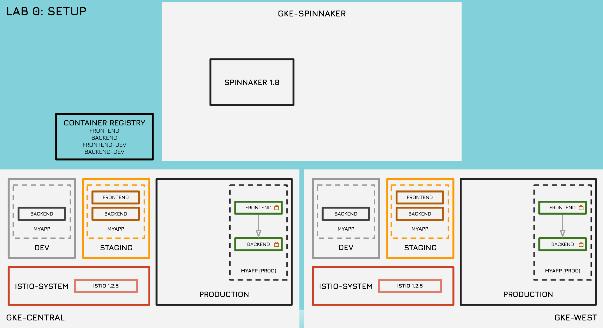

# Fairwinds Advanced Kubernetes Workshop

## Lab 0 - Setup

*Lab 0 Diagram*

+  Clone Repo with workshop files
+  Run setup script
+  Review the environment

## Lab 1 - Build

+ Example development workflow using Skaffold

## Lab 2 - Deploy

+ Trigger a Cloud Build of the the Docker image
+ Monitor Pipeline and trigger canary deployment

## Lab 3 - Control

### Istio

+ Gateways, VirtualServices, and DestinationRules
+ Request Routing
+ Rate Limiting
+ Circuit Breaking
+ mTLS

## Lab 4 - Monitor

+ Prometheus and Grafana Metrics
+ Tracing with Jaeger
+ Stackdriver logging and monitoring
+ Visualization with Kiali

## Resources

+ [Lab Guide](docs/lab_guide.pdf)
+ [Slides](docs/slides.pdf)
